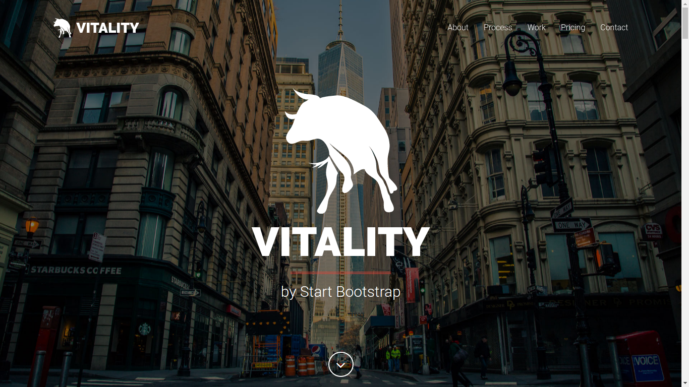
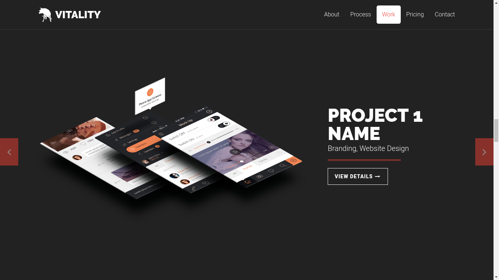
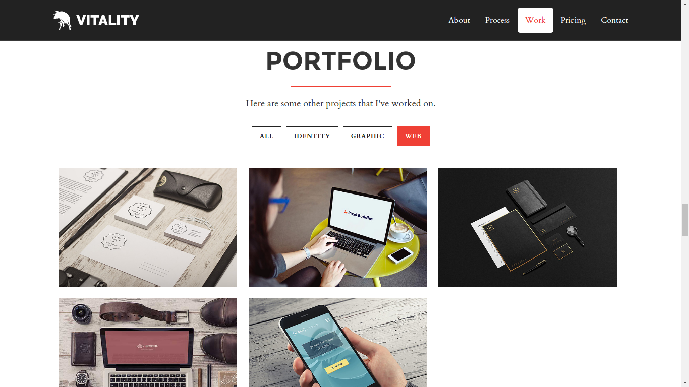

# Hugo Vitality Theme (Frame)

Hugo Vitality is a frame for the premium multipurpose one page Vitality theme by [StartBootstrap](//https://wrapbootstrap.com). This is not free. See instructions how to get it below. 

The theme features six different flavours: Agency, Creative, Culinary, Fashion, Legal and Video. It comes with a variety of different content sections, like a responsive portfolio grid, animated product presentation, testimonial section, pricing displays with hover effects, full page produkt item modals, a contact form and a newsletter subscription.







## Installation

Inside the folder of your Hugo site run:

    $ cd themes
    $ git clone https://github.com/hugo-startbootstrap-themes/hugo-vitality-theme

For more information read the official [setup guide](//gohugo.io/overview/installing/) of Hugo.


## Getting started

After installing the Hugo Vitality Theme successfully it requires a just a few more steps to get your site running.


### Install the StartBootstrap theme

The Hugo Vitality Theme is just a frame for the StartBootstrap Vitality theme. Vitality is a premium theme and is not free. A single licence costs $10. You can buy it here: [StartBootstrap Vitality](//wrapbootstrap.com/theme/vitality-multipurpose-one-page-theme-WB02K3KK3). From the downloaded zip file just extract the <em>contents</em> of the dist folder to the static folder of this project. After copying there has to be a `static/index.html` file.

### The config file

Take a look inside the [`exampleSite`](//github.com/hugo-startbootstrap-themes/hugo-vitality-theme/tree/master/exampleSite) folder of this theme. You'll find six config files called config-agency.toml, config-creative.toml, config-culinary.toml, config-fashion.toml, config-legal.toml, config-video.toml. Select one of them and copy it in the root folder of your Hugo site. Rename it to config.toml. Then test the site:

```
cp themes/hugo-vitality-theme/exampleSite/config-legal.toml config.toml
hugo serve
```
Now you can look at the site with a browser at address `http://localhost:1313`.

Feel free to change the strings in this theme. You will also find some hints there where to look next.


### Change the hero background and text

To change the hero eye-catcher of the site, open the file [`themes/hugo-vitality-theme/data/[your flavour]/hero.yaml`](//github.com/hugo-startbootstrap-themes/hugo-vitality-theme/tree/master/data/agency/hero.yaml) and change image locations and texts there, and then copy your images into the static/img folder. That's where hugo will look for it.


### Select the content sections

In the file [`themes/hugo-vitality-theme/layouts/index.html`](//github.com/hugo-startbootstrap-themes/hugo-vitality-theme/tree/master/layouts/index.html) you find the content structure of your new website. It is organised in partials in the partials folder. In the index.html file you find all the content sections for every flavour, one line each. Feel free to change order, add and remove lines there. The corresponding data you find in the `themes/hugo-vitality-theme/data` folder. There is a .yaml file for every content section. If you need to change the layout itself or add content, you can do it by changing the .html file in `themes/hugo-vitality-theme/layouts/partials/[your flavour]` folder. One content section is different: work.

### The Work section

The work section contains an extra work_ folder in the `themes/hugo-vitality-theme/data/[your flavour]` folder. In there you find one .yaml file per product/project page. Just modify those files, add or delete.

### Icons

All icons are part of Fontawesome's icon font. Look at the website of [Fontawesome](//fortawesome.github.io/Font-Awesome/icons/) for more icons. The icons are represented by their corresponding CSS class of Fontawesome. 

### Less vs. CSS

All custom styles of the theme are found in `static/css/vitality-red.css`. It is recommended not to change styles there, but in the static/less folder. The main less file is vitality.less. To compile it use the command

```
lessc static/less/vitality.less static/css/vitality-red.css
```

before invoking `hugo serve`. If you don't have less on your computer, you can get it here: [{less}](//lesscss.org/).


## Contributing

Did you find a bug or got an idea for a new feature? Feel free to use the [issue tracker](//github.com/hugo-startbootstrap-themes/hugo-vitality-theme) to let me know. Or make directly a [pull request](//github.com/hugo-startbootstrap-themes/hugo-vitality-theme/pulls).


## License

This theme is released under the Apache License 2.0 For more information read the [License](//github.com/digitalcraftsman/hugo-agency-theme/blob/master/LICENSE).

## Have fun!